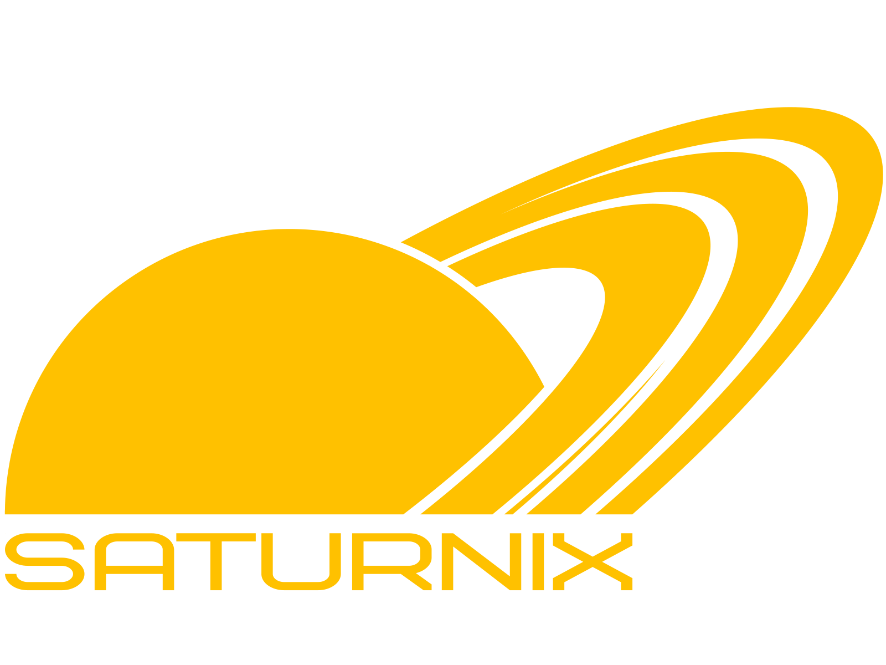
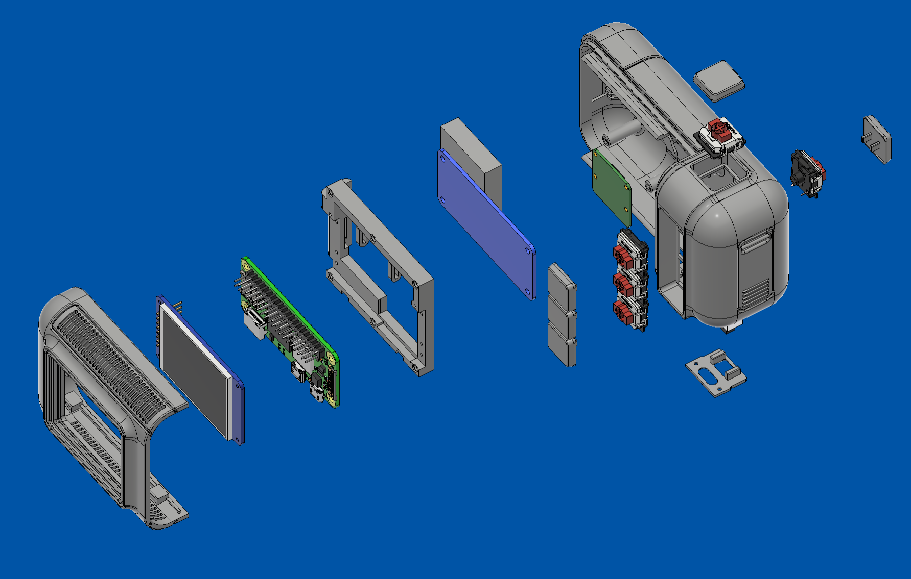

# SATURNIX

### Open-source digital camera with film simulation

  

> ## 🚧 **Firmware release coming soon.** Star this repo to get notified.
> ## ⚠️Project is under active development, structure and features may change

  

---
## Join our Discord community to stay up to date with development updates and news:

---

## What it is

SATURNIX is a DIY retrofuturistic digital camera built on a Raspberry Pi Zero 2W with a 16MP autofocus sensor and a small LCD viewfinder.
It shoots RAW+JPG and processes photos on-device using simple JPEG presets inspired by film stocks.
Image capture and processing run entirely on the Raspberry Pi. No external apps are required.

---

## Why I built it

About a year ago I just wanted a camera that felt good to use — something simple, physical, and that I could tweak however I wanted. I didn't like how modern cameras are designed, and I couldn't find anything open-source that felt right. So I built my own.

I spent a lot of time on how it feels to hold and use, not just on the code.

This isn't trying to replace a real camera. It's more of a personal experiment around:

- simple camera setups
- keeping everything local (no cloud)
- work on creating our own image processing system

**This started as a personal project. After sharing it online and seeing the level of interest, I decided to make it publicly available as open source.**

---

## Getting Started
The project is still in active development.

- Firmware &  Hardware release coming soon (I hope to publish the project in full within the next two weeks)
- Join Discord for dev updates and early access
  
---

## Early prototype (v0)

### This was one of the first working versions — about a year ago.

  

  

  

This started as a just-for-fun thing. Me and some friends were messing around with cameras and photography, and at some point I thought — why not try to build one from scratch?
This early version was all about getting things to actually work — sensor, buttons, screen, basic controls. It looked rough, felt rough, and that was fine. It was never meant to be pretty. We just wanted to see if it could work at all.
Turns out it could. So I kept going.
  
---

## Current state (v1)

### A year later — this is where we ended up

  

From a messy pile of wires that barely worked to an actual, usable camera.
The design takes a lot of cues from old 80s–90s electronics — that chunky, slightly industrial look that old gear used to have. I've always liked that aesthetic, so I leaned into it.

## Features

**Camera**
- 16MP autofocus sensor (Arducam IMX519)
- RAW (DNG) + JPG capture
- Full manual controls: Shutter (30s–1/4000), ISO (100–3200), WB, EV
- Autofocus modes: AF-C (continuous with lock), AF-S (single shot), MF (manual)

**JPEG presets (film-inspired)**
- **S-Gold** — warm, vintage, creamy tones
- **EKTAR** — higher saturation, stronger contrast, more aggressive sharpening
- **FUJI** — neutral colors with slight green shift
- **TRIX** — black & white with added contrast and grain
- **VHS** — lo-fi effect (scanlines, chromatic aberration, noise)

**Interface**
- 2" LCD live preview at 320×240
- Auto-hide UI (clean viewfinder after 15s)
- Live histogram with exposure traffic light
- Composition grids (Thirds, Golden Ratio, Cross)
- AF indicator with auto-detection
- Persistent settings (survive reboot)

**Connectivity**
- Built-in WiFi hotspot for transferring photos
- Simple web interface (terminal-style)
- Works without internet (direct connection to phone)

**Audio**
- Passive buzzer feedback for all actions
- Customizable: shutter, focus, navigation, startup sounds
- Mute mode

---

## Hardware

| Component | Model |
|---|---|
| Board | Raspberry Pi Zero 2W |
| Sensor | Arducam IMX519 16MP Autofocus |
| Display | Waveshare 2" IPS LCD (240×320, SPI) |
| Audio | Passive buzzer (MH-FMD) on GPIO |
| Storage | microSD (32GB+) |
| Power | USB-C / UPS HAT Waveshare (optional) |

**Buttons:** 5× mechanical low profile kailh switches — Left, Right, Select, Capture, Focus

---

### 3D Printed Case

STL files for the camera case are **available** in the [`hardware/`](hardware/) directory.

**The case is designed for resin printing (FDM version is being considered)**

  

---

## Known issues

### Assembly
 
- The assembly instructions are being finalized.
- Assembly is a bit complicated
- Requires soldering — **not beginner-friendly**

---

## UI:

The interface is designed to look like an old terminal. I like that look, and it's also much lighter on the processor than a fancy UI.
- **Colors**: Solid only — amber (#FFBF00), white, and black
- **Font**: DejaVu Sans Bold 14px via Pillow
- **Animation**: Minimal — blinking AF indicator, a capture animation, a progress bar
- **Optional atmosphere effects:** UI noise, decorative labels, and menu transition screens

*Decorative effects can be adjusted or disabled in the firmware configuration
file.*

__The main constraint is the processor — a 1 GHz Pi Zero. UI rendering has to stay under ~15ms per frame to keep the preview smooth. Right now I'm focused on performance rather than adding features.__

---

## Roadmap

- [x] Live preview + full manual controls
- [x] RAW+JPG capture with sequential naming
- [x] Film simulation engine (6 presets)
- [x] Live histogram + exposure indicator
- [x] Composition grids
- [x] WiFi photo transfer (hotspot + web gallery)
- [x] Auto-hide UI
- [x] Persistent settings
- [x] Buzzer audio feedback
- [x] Gallery with DNG support
- [x] Camera body and design improvements 
- [x] Battery indicator
- [x] Firmware cleanup
- [x] Open source release preparation
- [x] **Release**

---

## What works today

Spent today working on film simulation profiles. Trying to get the color science as close as possible to that classic film look, but it's still very much a work in progress — lots of tweaking ahead.
Also renaming all the filters to avoid any trademark issues: S-Gold, S-Vivid, S-MonoX, S-Natural, and more to come.

  
  

  
  

  

---

## Camera Photo

  

  

  

  

  

---

## UI Photo

  

  

  

---

## Film Samples

No filter

  

S-Gold

  

S-Natural

  

S-MonoX

  

---

## Photo Samples — Straight Out of Camera (No Filters)

  

  

  

  

---

RAW (DNG) files from Saturnix are available.

No edits, straight from the camera.

Download here:
https://drive.google.com/drive/folders/19HZnG9zmNsQW2zrbjA84-G9dMtUlpbSJ?usp=drive_link

---

## Installation

> ⏳ Pre-built image and installation guide will be available with the first public release. You can follow the dev blog in the project's Discord community.

---

## Licensing

This project uses a **multi-license** model:

| What | License | Commercial use |
|---|---|---|
| **Firmware** (Python code) | [MIT License](LICENSE) | Allowed |
| **Hardware** (STEP, STL, CAD files, 3D models, drawings, mechanical parts) | [CERN-OHL-S-2.0](hardware/LICENSE-HARDWARE.md) | Allowed under the license terms |
| **SATURNIX name and branding** | Permitted for project-related use | Allowed with attribution |

You may build, modify, distribute, and sell hardware based on this project,
including modified versions, provided that you comply with the applicable
open-source licenses.

You may use the **SATURNIX** name for forks, modified versions, compatible
parts, kits, builds, documentation, and commercial products based on this
project.

Please provide clear attribution to the original project where reasonable, for example:

> Based on the SATURNIX Camera open-source hardware project by Yutani140x.

Modified versions should clearly indicate that they are modified versions and
should not falsely claim to be the original author's own build or release.

---

## Support the Project

SATURNIX is built independently.
If you want to support development and future releases:

⭐ **Star this repo** to follow the development!

---

**Created by Yutani140x**

