# SATURNIX

### Open-source digital camera with film simulation

> [!WARNING]
> SATURNIX is under active development. The project structure, features, hardware files, and documentation may change.
> The assembly manual (`SATURNIX_Assembly_Manual.pdf`) is still being revised and may contain errors or outdated information.

<p align="center">
  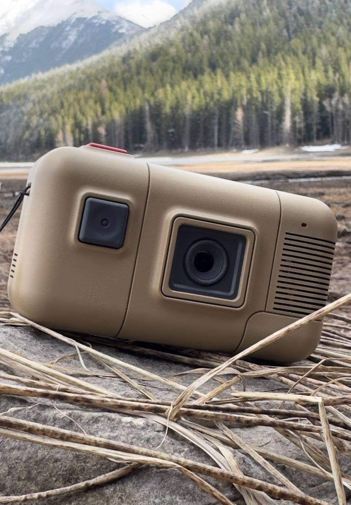
</p>

---
## Join our Discord community to stay up to date with development updates and news:

[](https://discord.gg/9S6AgTT6k6)

---

## Project Background

I have always been drawn to cassette futurism — the look of old analog machines, industrial computers, worn technical equipment, and retro-future interfaces. I also love cyberpunk worlds like *Blade Runner* and *Ghost in the Shell*, and I have always been interested in photography, especially cameras as physical technical devices.

About a year ago, I wanted to build a camera of my own: something simple, tactile, and fully under my control. I wanted a device that I could tune, modify, and shape around my own idea of what a camera should feel like — from the user interface to the physical body design.

With SATURNIX, I wanted to capture the feeling of cassette-futurist hardware. I focused a lot on how the camera feels in the hand and how it feels to use. For example, instead of using small cheap push buttons, I used full-size mechanical keyboard switches to make the controls feel more physical and deliberate.

This project is not trying to replace a commercial camera. It is a personal experiment around:

* designing a real physical camera body;
* creating a custom camera UI;
* building a simple on-device image processing system;
* working with Raspberry Pi camera hardware;
* experimenting with resin 3D printing, post-processing, painting, and weathering;
* making a device that feels personal, repairable, and open.

This was my first time building a device like this, so not everything is perfect. But looking back at where the project started about a year ago, I am happy with how far it has come.

The software was also a major part of the challenge. I am not primarily a software developer, and the code was one of the hardest parts of the project. A lot of the development was AI-assisted, starting with earlier AI models and improving significantly as newer coding models became available. This helped me finally bring the project much closer to the version I had imagined.

SATURNIX started as a personal project. After sharing it online and seeing the level of interest, I decided to make it publicly available as open source.

With the growing interest in old digital compact cameras, I also want this project to show that custom open-source digital cameras are possible. Instead of depending only on large companies, closed firmware, and fixed design choices, we can build devices that we fully understand, modify, repair, and shape for ourselves.

Maybe SATURNIX will inspire someone else to build something even better using this code, these files, or simply the idea behind it.


---

## Getting Started

### What it is

SATURNIX is a DIY digital camera inspired by cassette futurism, built around a Raspberry Pi Zero 2 W, a 16-megapixel autofocus sensor, and a small LCD viewfinder.

The camera captures photos in DNG+JPEG format and processes them directly on the device using simple JPEG presets inspired by film photography.

Image capture, storage, and processing are handled entirely by the Raspberry Pi Zero 2 W. No external apps or computer connection are required.

> **Read first:** the [Assembly Manual (PDF)](./SATURNIX_Assembly_Manual.pdf) contains safety notices for **resin printing** and **lithium battery handling**. Don't skip them. You build and operate this device at your own risk.

### Quick Build Overview

> Open **[`SATURNIX_Assembly_Manual`](./SATURNIX_Assembly_Manual.pdf)** and keep it nearby while building the camera.  

**1. Order the parts** — See the full BOM in Manual §02.  
Some electronics may take time to ship, so it is best to order the components first and print the parts while you wait.

> [!IMPORTANT]
> Make sure to order the correct UPS module: **[Waveshare UPS HAT (C)](https://www.waveshare.com/product/ups-hat-c.htm)**.  
> The case, wiring, battery monitoring, and shutdown behavior are designed around this specific board.

**2. Print the shell** — 3D-printable files are located in the `/hardware` folder.

The `/hardware` folder includes:

- `saturnix-camera-buttons.zip`  
  Keycap files for the mechanical camera buttons. Includes both STL and STEP files.

- `saturnix-camera-print-files-plain.zip`  
  Main camera body files without logos or text markings. Includes both STL and STEP files.

- `saturnix-camera-print-files-with-logo.zip`  
  Main camera body files with SATURNIX logos and text markings. Includes both STL and STEP files.

The main structural parts are designed for resin/MSLA printing. ABS-like resin is required for better strength and durability. A reference print profile for the Anycubic Photon P1 is included in Manual §03.

**3. Wire the electronics** — See the master GPIO pinout and per-module wiring diagrams in Manual §04.

Note: the UPS HAT factory GPIO header and onboard switch are removed. The HAT is hard-wired because it does not fit inside the shell otherwise. See Manual §06 for details.

**4. Flash and install the software** — Follow Manual §05, or use the condensed setup below:

```text
OS:        Raspberry Pi OS (Legacy, 32-bit) — Debian Bookworm
Hostname:  saturnix-dione     ← hard-coded, use exactly this
User:      saturnix / saturnix
```

Enable I2C and SPI, install the required packages and the Arducam IMX519 driver, then copy the `python/` and `saturnix-dione/` folders from this repository to the Raspberry Pi Desktop.

The paths are currently hard-coded, so keep the folder locations unchanged.

Then run:

```bash
cd ~/Desktop/saturnix-dione
sudo ./setup_wifi_hotspot.sh   # photo transfer: SaturnixCam / saturnix24 / 192.168.4.1
sudo ./setup_fast_boot.sh      # autostart on power-up
sudo reboot
```

Before closing the case, verify that the display, buttons, autofocus, buzzer, and Wi-Fi hotspot all work correctly.

**5. Assemble the camera** — See the exploded view and the 16 step-by-step assembly photos in Manual §06.

Once everything has been tested with the case open, close the shell, install the screws, and go shoot.

## Configuration

All main camera behavior is controlled through `config.json`.

This includes ISO and shutter menus, JPEG presets, UI colors, GPIO pins, Wi-Fi settings, and battery thresholds. The full configuration reference is available in Manual §07.

> ⚠️ **The camera automatically shuts down at 5% battery.**
> If the camera powers off shortly after boot, check the UPS HAT wiring, especially SDA, SCL, and power connections. Also make sure I2C is enabled. For testing, you can temporarily adjust `battery_shutdown_pct/battery_auto_shutdown` in `config.json`.

---

## Project Evolution

SATURNIX went through several stages before reaching the current release.  
It started as a rough proof-of-concept and gradually evolved into a complete open-source DIY digital camera.

### Early prototype (v0)
**This was one of the first working versions — about a year ago.**

<p align="center">
  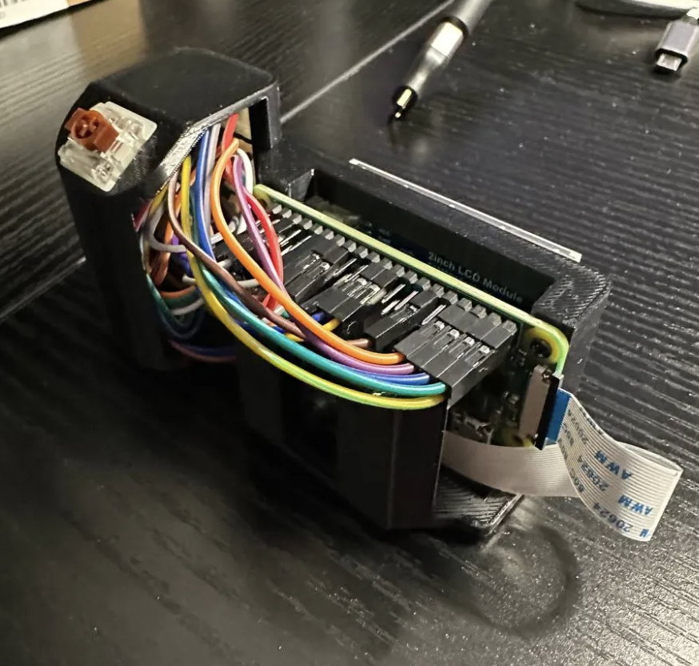
</p>

<p align="center">
  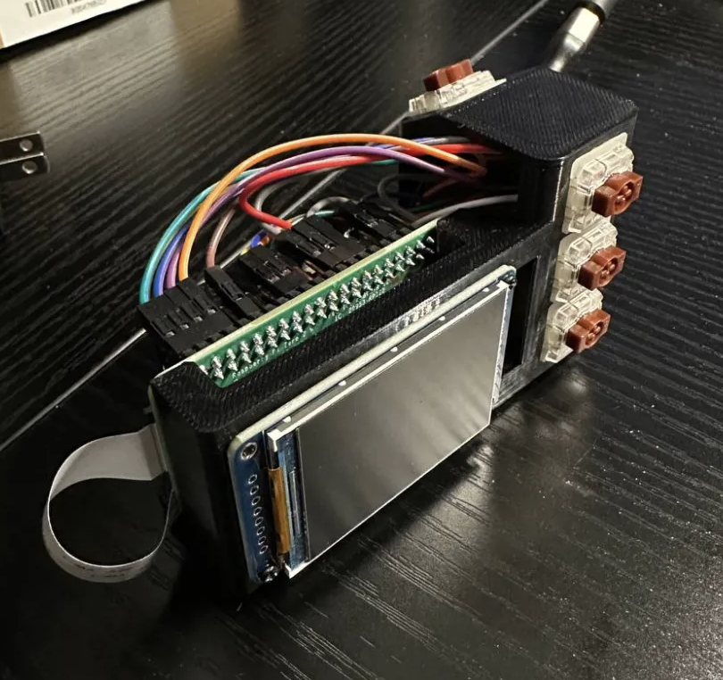
</p>

<p align="center">
  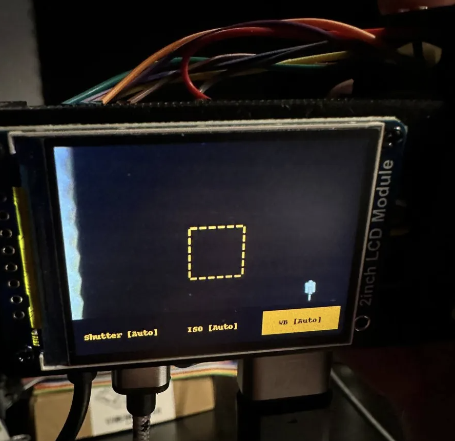
</p>

The first prototype was a rough proof of concept.

I wanted to see if I could build a simple self-contained digital camera from scratch — something physical, tactile, and fully under my control. This version was not meant to be polished. It was built to test the basic idea: sensor, screen, buttons, basic controls, and image capture.

At this stage, there was almost no real UI. The camera could only take photos and change a few basic capture parameters, but that was enough. It looked rough and felt rough, but it worked.

More importantly, V0 proved that the project could become a real handheld camera rather than just a Raspberry Pi experiment.

So I kept going.

### First Usable Build (v1)
**The first fully working version, about four months ago**

<table>
  <tr>
    <td width="50%">
      
    </td>
    <td width="50%">
      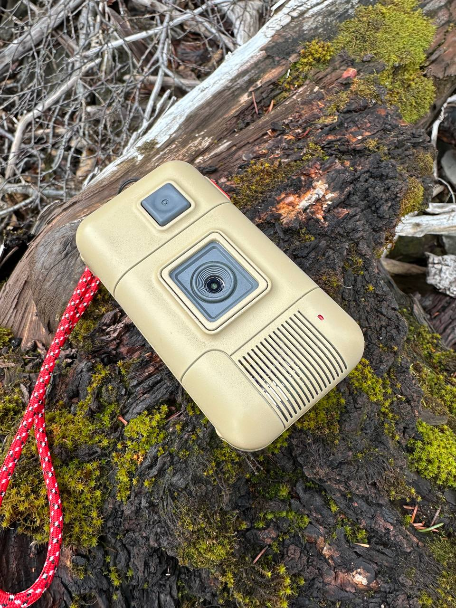
    </td>
  </tr>
  <tr>
    <td width="50%">
      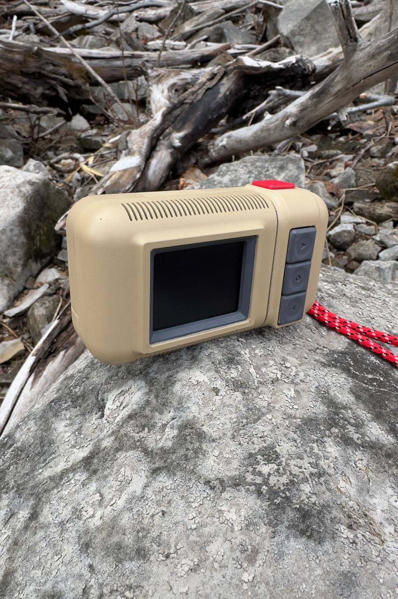
    </td>
    <td width="50%">
      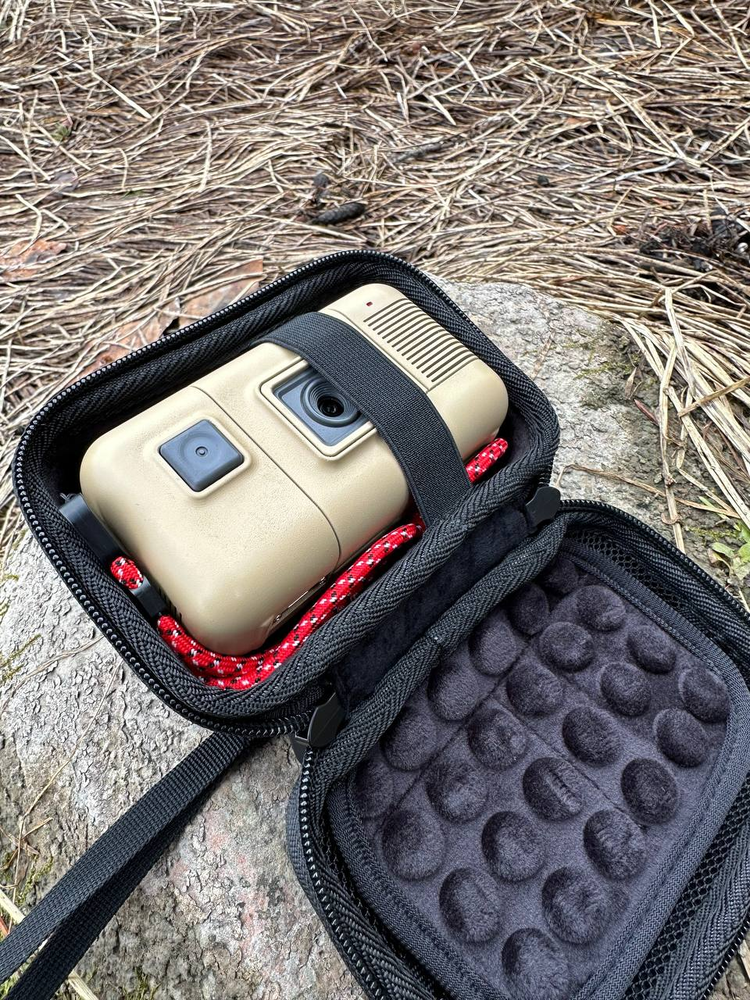
    </td>
  </tr>
</table>

Version 1 was the first SATURNIX build that started to feel like a real camera rather than a loose prototype.

By this stage, the project had a basic printed body, a working screen, physical controls, a simple UI, and a functional capture pipeline. It was still rough, but it finally looked and behaved like a standalone handheld device.

The design already leaned into the cassette-futurist direction: a compact body, visible physical controls, an industrial shape, and an interface inspired by old terminals and technical equipment.

However, this version still had many limitations.

The internal power system was not reliable yet, so I powered the camera from an external power bank using a cable. Image capture was also very slow — one photo could take around 25 seconds because of inefficient capture logic. JPEG presets already existed, but the results were inconsistent, and processing a single image could take about a minute.

Many interface features were also missing at this stage. There was no Wi-Fi image transfer yet, and several tools from the current version, such as the exposure meter and more advanced viewfinder elements, were not implemented.

Even with all these problems, V1 was an important milestone. It had a real UI, it could take photos, and it was usable enough to bring outside.

<p align="center">
  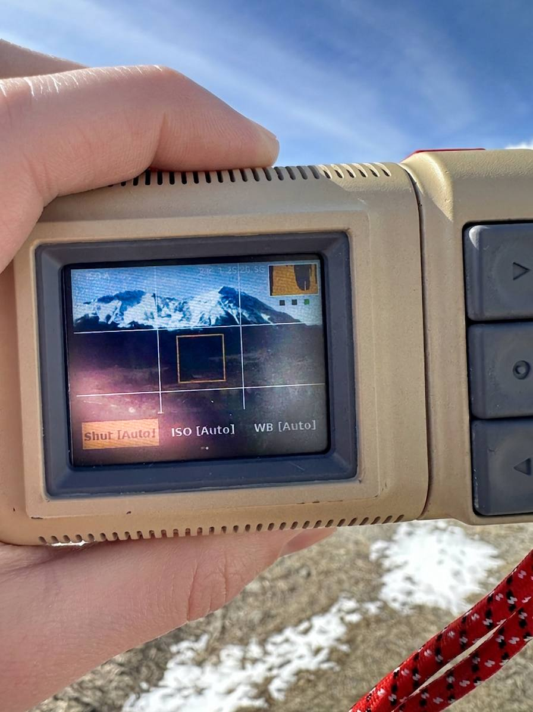
</p>

I traveled with this version for about a week in the mountains near Calgary and took many photos with it. That trip proved that SATURNIX was no longer just a bench experiment. It was already becoming a real camera.

This was also the version I first shared online. To my surprise, it received much more attention than I expected — people reacted strongly to the physical design, the cassette-futurist look, and the idea of an open-source custom digital camera. That response was one of the reasons I decided to continue developing SATURNIX more seriously and prepare it as a public open-source project.

## Version 2 — Current Release
**A year later — this is where we ended up**

<p align="center">
  
</p>

Version 2 is the current public release of SATURNIX.

This release model is called **SATURNIX Dione**, named after one of Saturn’s moons.

The name is intentional. SATURNIX is planned as a broader camera project, not just a single device. I am also working on a more advanced camera concept with a 1-inch sensor and interchangeable C/CS-mount lenses, so naming this version **Dione** helps separate it from future SATURNIX models.

At this stage, the camera is no longer just a rough prototype. The body has been redesigned and refined, the battery system is fully integrated, the interface has been rebuilt, and the capture pipeline has been improved as much as possible within the limits of the Raspberry Pi Zero 2 W.

The goal was not to make SATURNIX look like a clean modern product. I wanted it to feel more like a retro-futuristic technical object — something closer to an old industrial camera, a cassette-futurist prop, or a piece of equipment from a used sci-fi world.

The case was also completely reworked visually. I experimented with painting and weathering for the first time: an aged ivory base, dark panel lines, washes, dry-brushing, worn labels, and small red details. The result feels much closer to the original idea — a camera that looks like it already has a history.

<p align="center">
  
</p>

<p align="center">
  
</p>

<p align="center">
  
</p>

<p align="center">
  
</p>

<p align="center">
  
</p>

<p align="center">
  
</p>

Compared to V1, this version is much more complete. The camera now has a proper internal battery setup, a more usable UI, Wi-Fi photo transfer, better feedback, more capture tools, and two different shooting modes.

It is still an experimental DIY camera, and it still has limitations. The Raspberry Pi Zero 2 W is the main bottleneck. Full-resolution capture is not instant, but this version is the best balance I could get between image quality, usability, and the hardware I chose.

---

#### Main Features

**Camera**

- 16 MP autofocus sensor — Arducam IMX519
- DNG + JPEG capture
- Full manual controls:
  - shutter speed
  - ISO
  - white balance
  - exposure compensation
- Autofocus modes:
  - AF-C — continuous autofocus with lock
  - AF-S — single autofocus
  - MF — manual focus

**Capture Modes**

SATURNIX V2 has two main capture approaches:

- **Standard Capture**  
  Full-resolution capture with DNG/JPEG output. This mode is intended for landscapes, portraits, static scenes, and situations where image quality matters more than speed.

- **Dynamic Mode**  
  A faster capture mode that grabs frames directly from the live preview stream. It is lower resolution and does not support DNG or HDR, but it is almost instant and useful for street photography, pets, movement, or “right now” shots.

Dynamic Mode is one of the biggest improvements in V2.  
On the Raspberry Pi Zero 2 W, full-resolution capture can still take around 8–12 seconds, depending on settings. Dynamic Mode avoids that delay by using the preview stream instead.

Use Standard Capture when quality matters.  
Use Dynamic Mode when timing matters.

**JPEG Presets**

Film-inspired JPEG presets are processed directly on the camera:

- **S-Saturnix** — warm golden light, raised indigo shadows, soft contrast, bloom in highlights
- **S-Gold** — warm, vintage, creamy tones
- **S-Vivid** — higher saturation, stronger contrast, sharper look
- **S-Natural** — more neutral colors with a slight green shift
- **S-MonoX** — black and white with added contrast and grain
- **VHS** — lo-fi look with scanlines, chromatic aberration, and noise

These presets are not meant to be accurate film simulations. They are simple creative looks designed to run directly on the Raspberry Pi.

**Interface**
- 2" LCD live preview
- Terminal-inspired UI
- Auto-hide interface for a cleaner viewfinder
- Live histogram
- Exposure meter
- Composition guides
- AF indicator
- Capture animation
- Processing indicator
- Persistent settings after reboot
- Optional decorative UI effects:
  - CRT-style noise
  - technical labels
  - calibration ticks
  - transition screens

The UI is intentionally overdesigned in a sci-fi / terminal direction, but it is still built to stay lightweight enough for the Pi Zero 2 W.

**Power**

- Fully integrated UPS HAT battery system
- Real battery percentage display
- Charging indicator
- Automatic shutdown at low battery
- Helps prevent corrupted SD cards from sudden power loss

**Connectivity**

- Built-in Wi-Fi hotspot
- Works without internet
- Direct phone connection
- Simple web interface for transferring photos

**Audio Feedback**

- Passive buzzer feedback for camera actions
- Shutter sound
- Focus sound
- Navigation sounds
- Startup sound
- Mute mode

**Extra Tools**

- HDR bracketing: 3 frames at -2 / 0 / +2 EV
- Self-timer: 2s / 5s / 10s
- Burst options in Dynamic Mode
- EXIF metadata:
  - Make: SATURNIX
  - Model: Dione
- Optional Olympus-style watermark

---

#### Hardware

| Component | Model |
|---|---|
| Board | Raspberry Pi Zero 2 W |
| Sensor | Arducam IMX519 16 MP Autofocus |
| Display | Waveshare 2" IPS LCD |
| Audio | Passive buzzer |
| Storage | microSD card, 32 GB+ recommended |
| Power | Waveshare UPS HAT with integrated battery |
| Controls | 5× mechanical keyboard switches |

**Buttons:** Left, Right, Select, Capture, Focus

The camera uses full-size mechanical-style controls instead of small cheap push buttons. This was an intentional design choice: I wanted the controls to feel physical, tactile, and deliberate.

**What Changed Since V1**

Version 1 proved that SATURNIX could work as a real handheld camera, but it still had many problems. The camera was powered from an external power bank, capture was slow, image processing was inconsistent, and many interface features were missing.

Version 2 improves the project in several major areas:

- redesigned and refined body shell;
- fully integrated battery system;
- improved internal wiring and assembly;
- faster and more reliable capture workflow;
- new Dynamic Mode for instant shots;
- Wi-Fi photo transfer;
- improved UI with exposure tools;
- better JPEG preset system;
- battery monitoring and safe shutdown;
- improved visual design, painting, and weathering;
- cleaner repository structure for public open-source release.

This release is much closer to the original idea: a self-contained open-source digital camera that feels like a real physical object, not just a Raspberry Pi project in a box.

---

**Current Limitations**

SATURNIX is still a DIY experimental camera.

The main limitation is the Raspberry Pi Zero 2 W. Full-resolution capture is slow, and after many attempts to optimize it, around 3–9 seconds per full-quality shot is the practical limit I was able to reach.

Dynamic Mode solves the speed problem, but it does so by using preview-resolution frames. That means it is much faster, but it cannot replace full-resolution DNG/JPEG capture.

So the camera has two different personalities:

- **Standard Capture** — slower, higher quality, full-resolution.
- **Dynamic Mode** — fast, lower resolution, better for moments.

This tradeoff is part of the project. SATURNIX is not trying to compete with modern commercial cameras. It is an open-source platform for experimenting with camera hardware, software, interface design, image processing, and physical product design.

---

## Camera Photo


---

## UI Photo

<p align="center">
  
</p>

<p align="center">
  
</p>

<p align="center">
  
</p>

---

## Film Samples

No filter
<p align="center">
  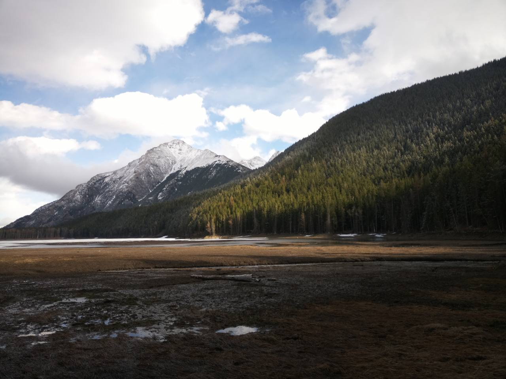
</p>


S-Gold
<p align="center">
  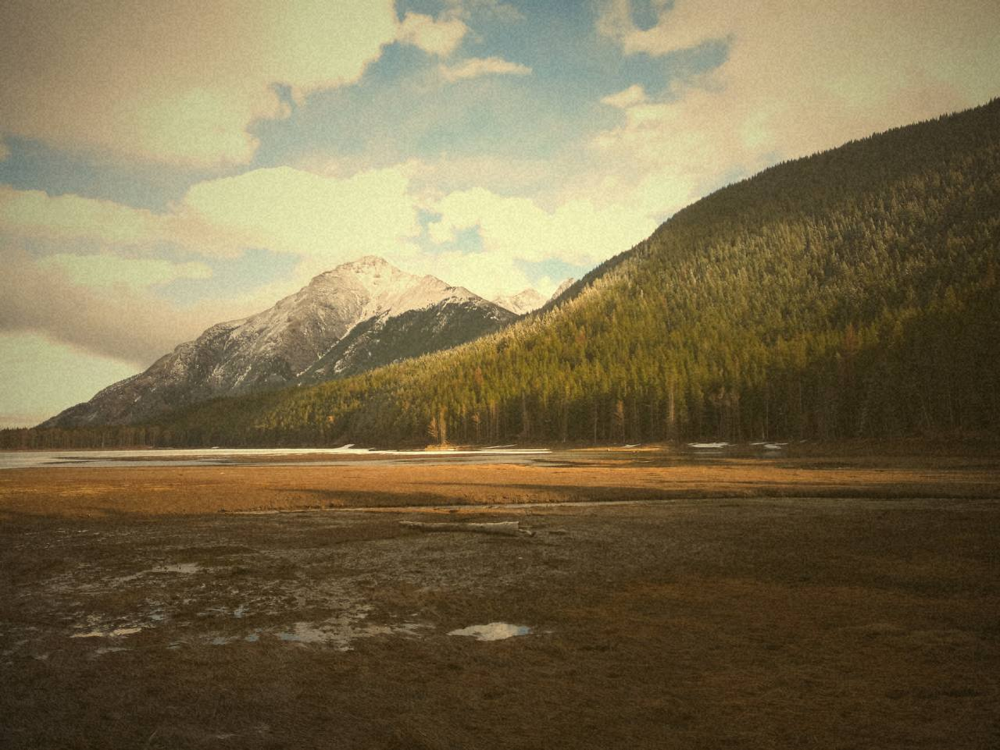
</p>


S-Natural
<p align="center">
  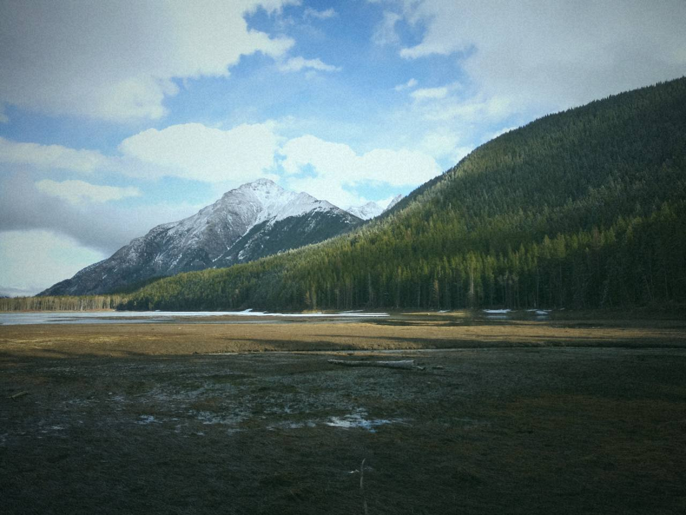
</p>


S-MonoX
<p align="center">
  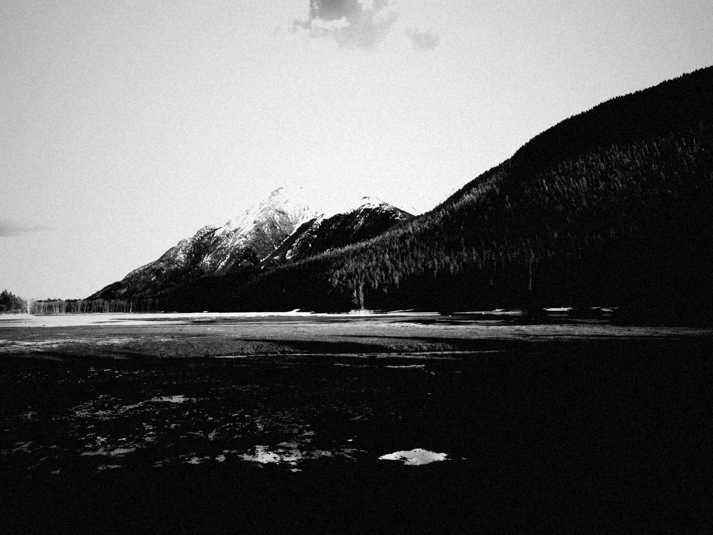
</p>

---

## Photo Samples — Straight Out of Camera (No Filters)

<p align="center">
  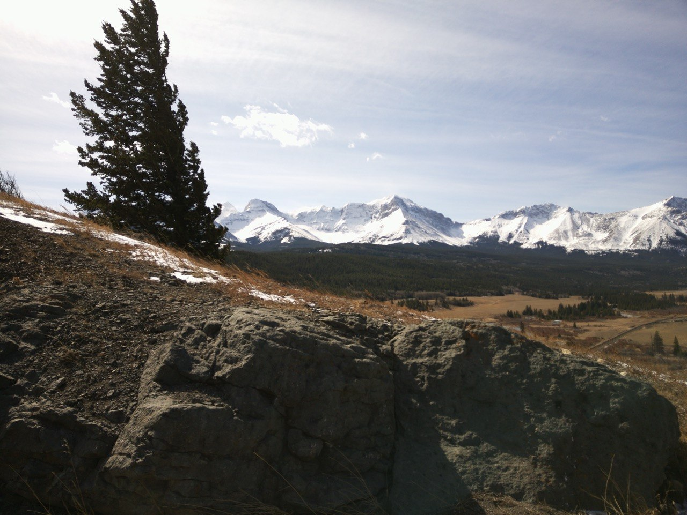
</p>

<p align="center">
  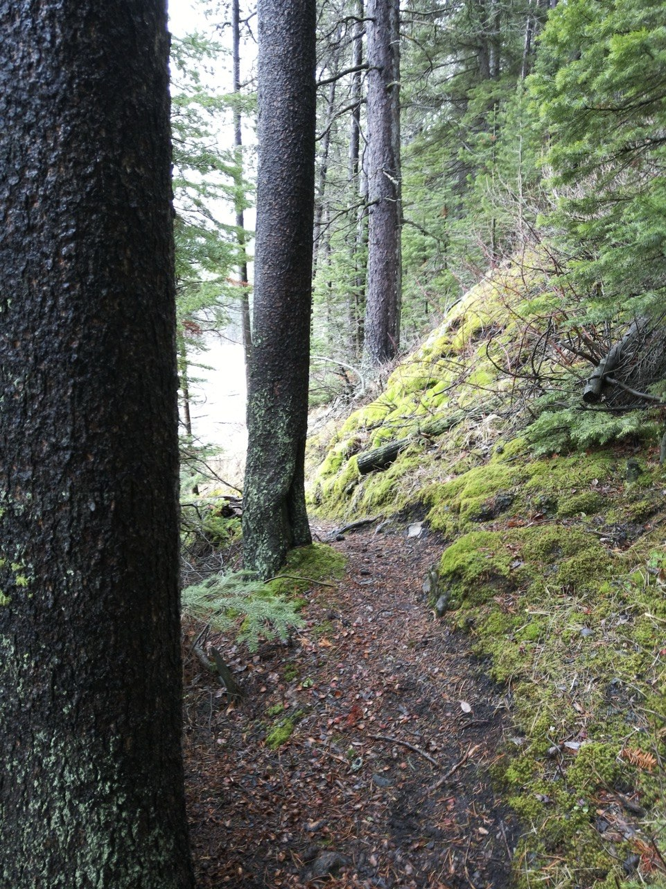
</p>

<p align="center">
  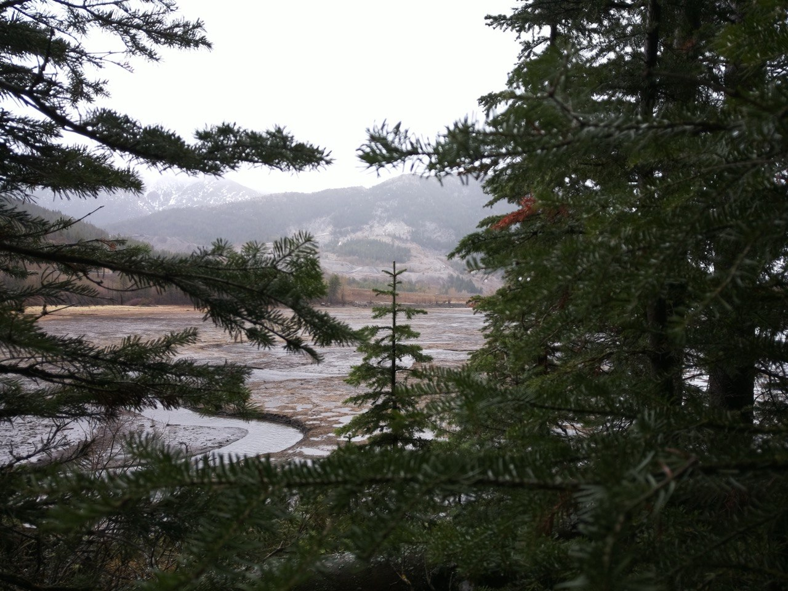
</p>

<p align="center">
  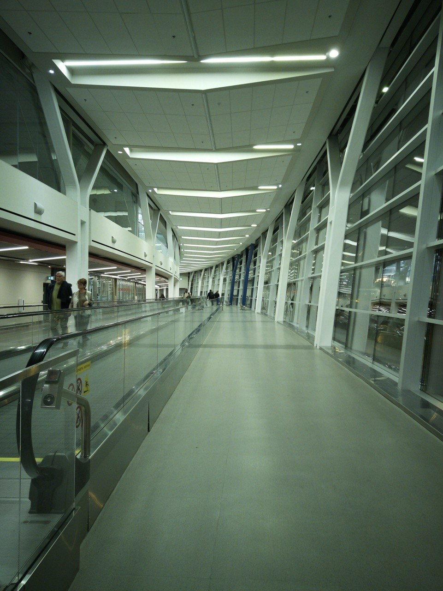
</p>

---

RAW (DNG) files from Saturnix are available.

No edits, straight from the camera.

Download here:
https://drive.google.com/drive/folders/19HZnG9zmNsQW2zrbjA84-G9dMtUlpbSJ?usp=drive_link

---

## Licensing

This project uses a **multi-license** model:

| What | License | Commercial use |
|---|---|---|
| **Firmware** (Python code) | [MIT License](LICENSE) | Allowed |
| **Hardware** (STEP, STL, CAD files, 3D models, drawings, mechanical parts) | [CERN-OHL-S-2.0](hardware/LICENSE-HARDWARE.md) | Allowed under the license terms |
| **SATURNIX name and branding** | Permitted for project-related use | Allowed with attribution |

You may build, modify, distribute, and sell hardware based on this project,
including modified versions, provided that you comply with the applicable
open-source licenses.

You may use the **SATURNIX** name for forks, modified versions, compatible
parts, kits, builds, documentation, and commercial products based on this
project.

Please provide clear attribution to the original project where reasonable, for example:

> Based on the SATURNIX Camera open-source hardware project by Yutani140x.

**Modified versions should clearly indicate that they are modified versions and
should not falsely claim to be the original author's own build or release.**

---

## Support the Project

SATURNIX is built independently.
If you want to support development and future releases:

[](https://discord.gg/9S6AgTT6k6)

[](https://buymeacoffee.com/yutani140x)

[](https://ko-fi.com/yutani)

[](https://patreon.com/Yutani140x)


⭐ **Star this repo** to follow the development!

---

**Created by Yutani140x**
